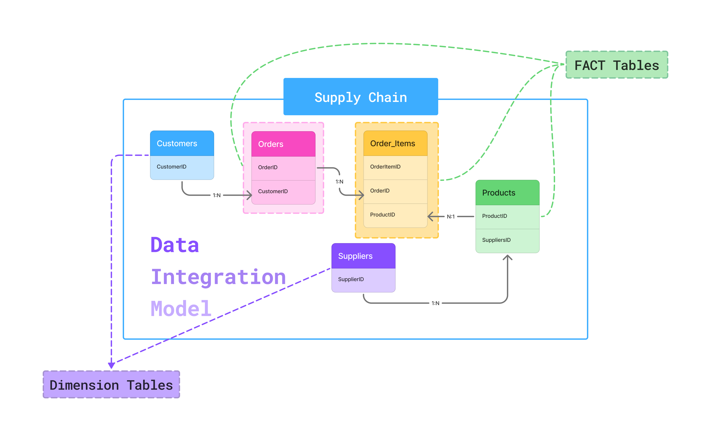

# Supply Chain Project

## **Problem Statement**
Rapid Sales Growth in the Port Harcourt Market Reveals Critical Bottlenecks in Product Availability and Order Fulfillment, Threatening Customer Retention for Newly Acquired Customers.

### **Stakeholders**
The Country Manager and Head of E-commerce Operations (Nigeria)

**Objectives for the Stakeholder**:

1. **Pinpoint Key Product Availability Gaps**: 
Identify which of the 200 products are most frequently out of stock or are major contributors to Cancelled orders, 
especially for shipments to Port Harcourt and surrounding areas, despite the high order volume
2. **Assess Impact on Recent Customer Cohorts**: 
Determine if fulfillment issues (e.g., significant delays where ActualDeliveryDate far exceeds ExpectedDeliveryDate, or high cancellation rates) are disproportionately affecting customers acquired since March 2024 (RegistrationDate > 2024-03-01), and if this correlates
with lower initial repeat purchase rates from these new customers
3. **Identify Top Supplier-Related Fulfillment Constraints**: 
For the limited set of 15 suppliers, determine which ones are linked to the products experiencing 
the most severe availability gaps or quality issues (inferred from ReturnStatus) that impede smooth order fulfillment to the Port Harcourt market.
---
# Data Integration Model

  

  <em><code>fig: Data Integration Model of Supply chain</code></em>

